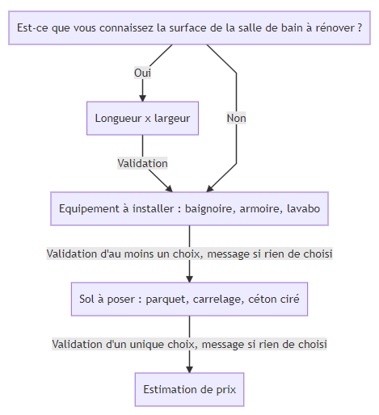

# RenovationMan

This project is a demo of a survey that will help you renovate your bathroom. It uses  [Angular](https://angular.io/) and [Angular Material](https://material.angular.io/).

## [Live Demo](https://renovation.gritchou.dev/)

## Development server

If it is your first installation, run `npm install`.

Run `npm start` for a dev server. Navigate to `http://localhost:4200/`. The app will automatically reload if you change any of the source files.

## Build

Run `ng build` to build the project. The build artifacts will be stored in the `dist/` directory. Use the `--prod` flag for a production build.

## Running unit tests

Run `ng test` to execute the unit tests via [Karma](https://karma-runner.github.io).

## Running end-to-end tests

Run `ng e2e` to execute the end-to-end tests via [Protractor](http://www.protractortest.org/).

## Debug mode

To display states of the survey, set `DEBUG = true` in stepper.component.ts

## Survey workflow

Here is the user workflow threw the survey:

## Algorythme d'estimation du prix

- Prix baignoire = 1000 €
- Prix lavabo = 100 €
- Prix meuble = 250 €
- Si dimensions de la pièce : Prix sol = Longueur (m) * largeur (m) * Prix matériau (m²) €
- Si pas de  dimensions : Prix sol = 2000 €
- Prix parquet = 25 € / m²
- Prix carrelage = 15 € / m²
- Prix béton ciré = 40 € / m²
